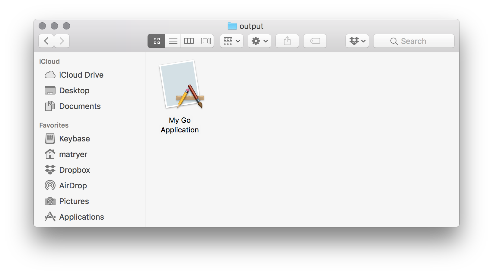

# appify

Create a macOS Application from an executable (like a Go binary)

## Install

To install `appify`:

```bash
go get github.com/machinebox/appify
```

## Usage

```
appify -name "My Go Application" /path/to/bin
```

It will create a macOS Application 


